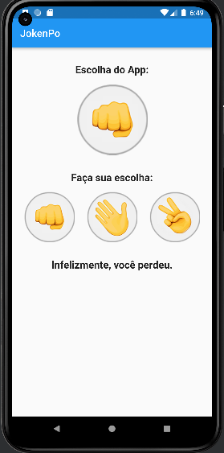

O projeto JokenPo tem o proposito de iniciar meus estudos com Flutter.

Ele faz parte do curso do professor Jamilton Damasceno.

Efetuei algumas modificações que julguei ser necessario.

------------------------------------------------------------------------
Tela inicial:

------------------------------------------------------------------------
Tela Vitoria:

------------------------------------------------------------------------
Tela Derrota:

------------------------------------------------------------------------
Tela Empate:

